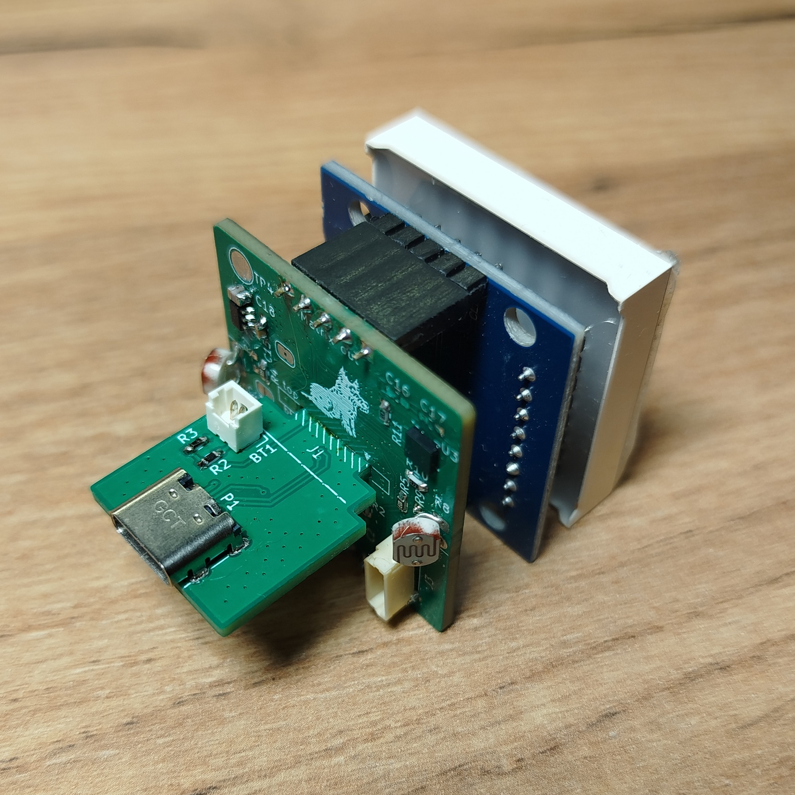
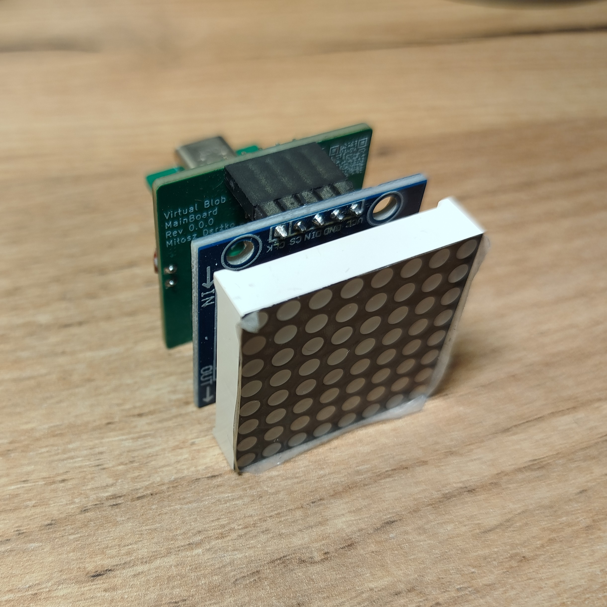

# Virtual Blob Hardware

[← Back to main repository](https://github.com/MiCyg/VirtualBlob.git)

---

The device consists of three PCBs:
- `MainBoard` – microcontroller and peripheral interfaces
- `PowerBoard` – USB connector and battery charging circuit
- `LedBoard` – LED matrix driven by the MAX7219

Components on the boards:
- RP2040 microcontroller with SWD programming interface
- Accelerometer LIS3DH
- Capacitive touch sensor AT42QT1011
- Light sensor (LDR with resistor divider)
- Li-Po battery (LP852040)
- Battery charger MCP73811T

## Description

The `MainBoard` and `PowerBoard` are connected using a custom-designed `EdgeConn` board-to-board connector, allowing a 90° connection between the two.
Due to the small overall size and the position of the USB connector, I decided to use a ready-made LED matrix module. This approach saves valuable PCB space on the `MainBoard`, which is limited by the placement of the edge connector.

The device is designed to operate continuously from a Li-Po battery. Therefore, proper power management in sleep mode is crucial. To reduce power consumption, a high-side P-MOSFET switch is used to disconnect the accelerometer and light sensors when the system enters sleep mode. The capacitive touch sensor remains powered at all times, as it is responsible for waking up the device.

## Assembled Boards

	
	

